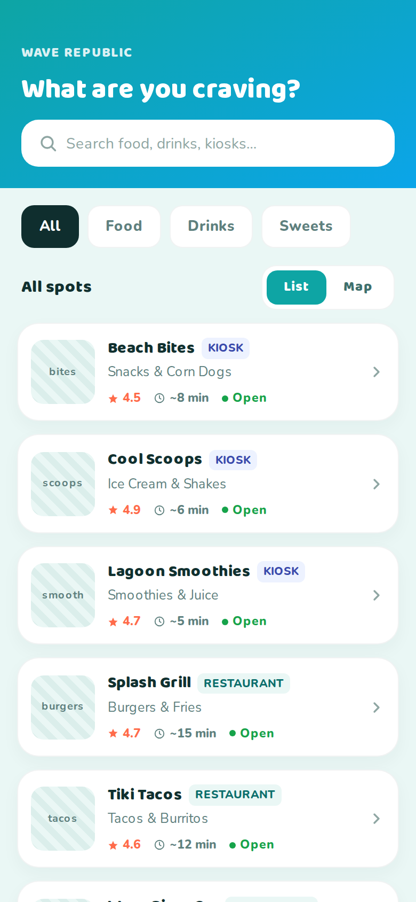
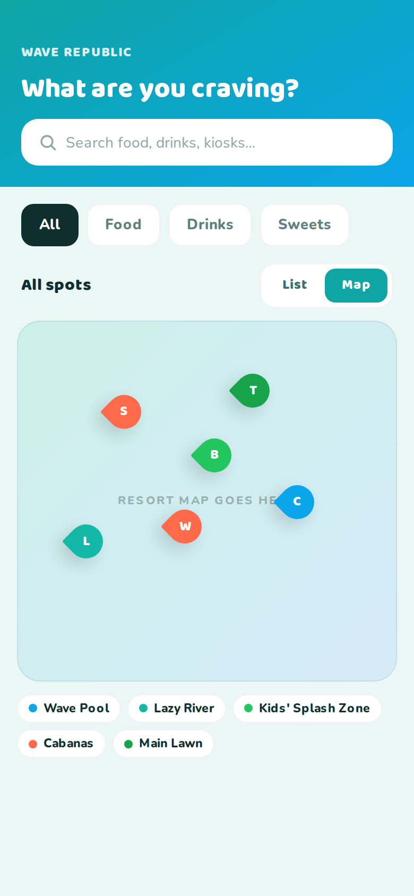
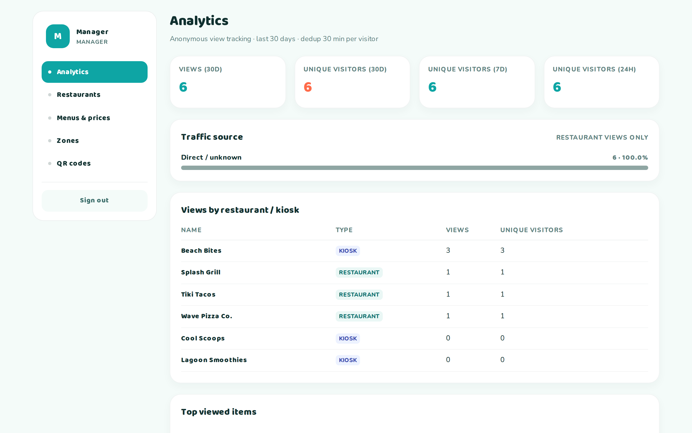
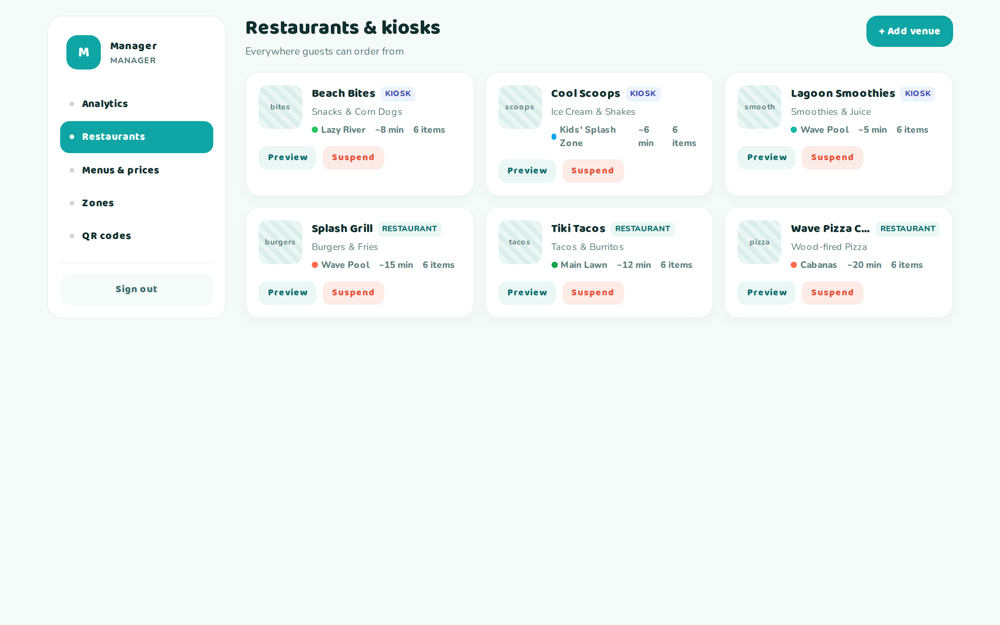
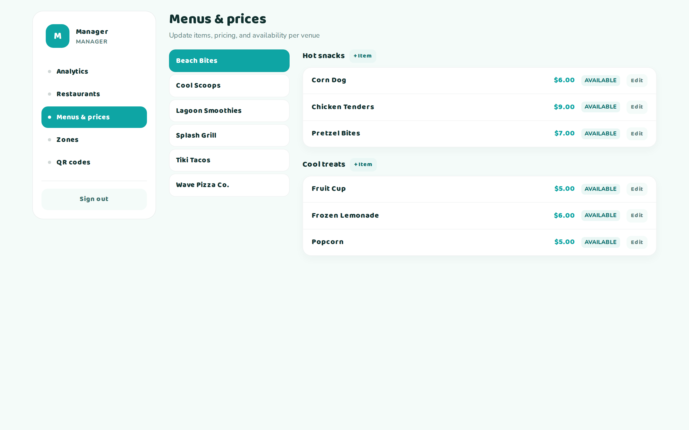
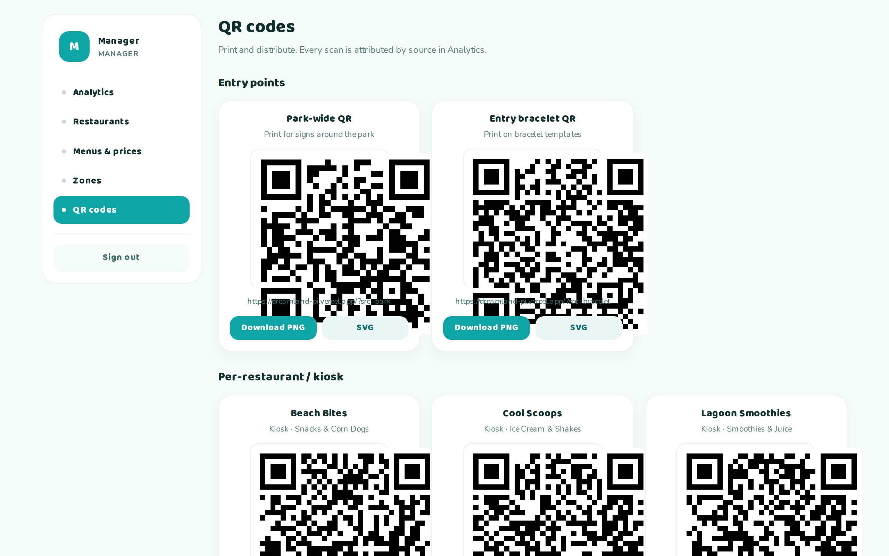

# Wave Republic

Order food and drinks from anywhere in a waterpark — scan a QR code, browse restaurants, place an order, track it to your zone.

**Live demo:** [dreamland-pi.vercel.app](https://dreamland-pi.vercel.app) &nbsp;·&nbsp; **Manager console:** [/login](https://dreamland-pi.vercel.app/login) (`manager` / `dreamland`)



> All venue names, restaurants, zones, staff, and customer data in this repo are fictional. This is a portfolio piece; Wave Republic is not a real waterpark.

---

## The problem

Waterparks are food-service nightmares. Guests are wet, wearing swimsuits with no wallets, and don't want to leave their zone to queue at a kiosk. Operators lose sales to friction — and to zero visibility into which food outlets are pulling foot traffic.

## The solution

A single web app with two connected surfaces:

- **Customer PWA** (mobile) — scan a zone QR, browse restaurants on a list or map, order, pay, track. No app install; works from any phone camera.
- **Manager console** (desktop) — orders board, per-venue menus & pricing, zone management, printable QR codes, and view-tracking analytics that attribute every scan back to its source.

Phase 1 (deployed) focuses on the browse/menu/analytics/QR loop. Ordering, payments, cashier flows, and delivery are architected in the same codebase and staged for Phase 2.

## Screenshots

### Customer (mobile PWA)
| Home — list view | Zone map | Restaurant menu |
|---|---|---|
|  |  |  |

### Manager console (desktop)
| Analytics | Restaurants | Menus & prices | QR codes |
|---|---|---|---|
|  |  |  |  |

## Key features

**Customer**
- Restaurant/kiosk directory with list and interactive map views
- Category-scoped menus (food / drinks / sweets)
- Anonymous view tracking via a rotating visitor cookie — no signup required
- PWA (installable, offline shell)

**Manager**
- Analytics with 24h / 7d / 30d windows, per-restaurant view attribution, and traffic-source breakdown
- Menu editor with per-item pricing and availability toggles
- Zone manager (park sections with color coding)
- QR generator with per-venue and per-entry-point codes, PNG + SVG export
- Session-based auth with server-side password hashing

## Tech stack

- **Next.js 16** (App Router, React 19, Turbopack)
- **Prisma 7** + **PostgreSQL** (Neon Serverless, Frankfurt region for Dubai-user latency)
- **Tailwind 4** with a custom design token system
- **Vercel** hosting

## Architecture notes

- **All request-boundary APIs are async.** Next.js 16 makes `params`, `searchParams`, `cookies()`, and `headers()` Promises — see [`docs/nextjs16-notes.md`](docs/nextjs16-notes.md) for the framework quirks that broke assumptions carried over from v15.
- **Zone-scoped ordering.** Customers can only order when they hold a valid zone session (obtained by scanning a zone QR). This is an anti-scam gate for Phase 2 payments — orders shouldn't be placeable from anywhere on the internet.
- **No permanent deletes.** Every user-facing entity uses soft-suspend or archive semantics. Only join-table cleanup does hard deletes.
- **Serverless Postgres has cold starts.** Neon in Frankfurt is the closest region to Dubai (Middle East has no Neon region as of 2026-07). Expect ~110ms baseline latency plus cold-start delay on the first request after idle.

## Local development

```bash
git clone git@github.com:EliasAbouKhater/dreamland.git
cd dreamland
npm install
cp .env.example .env    # set DATABASE_URL, DIRECT_URL, AUTH_SECRET
npx prisma db push
npm run db:seed
npm run dev
```

Login with `manager` / `dreamland` or `admin` / `admin` after seeding.

## Roadmap

- **Phase 1 (shipped):** browse, menus, analytics, QR codes, manager auth
- **Phase 2:** cart + Stripe checkout (test mode), order state machine, cashier board, delivery zone routing
- **Phase 3:** wallet / prepaid balance, team roles (owner / manager / cashier), reporting exports

## About this project

Built solo across ~3 weeks. The design system, seed data, backend, and deploy pipeline are all mine. Fictional names throughout because the real client isn't public.
